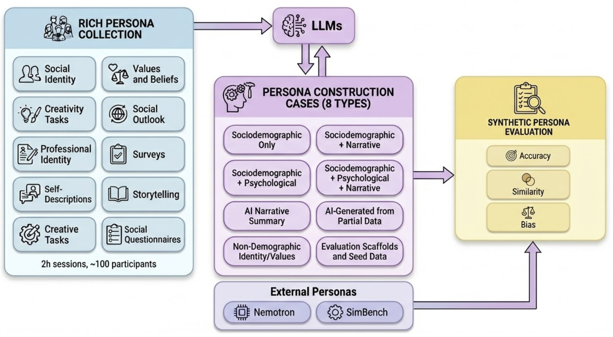

# SCOPE: Sociopsychological Construct of Persona Evaluation

A framework for constructing and evaluating socially-grounded synthetic personas for LLM-based user simulation.

## Overview

SCOPE is a human-grounded framework for constructing and evaluating synthetic personas. Unlike demographic-only or summary-based personas, SCOPE models personas as **multidimensional sociopsychological profiles** spanning eight behavioral facets:

1. **Demographic Information** - Basic background and identity attributes
2. **Sociodemographic Behavior** - Digital habits, civic engagement, lifestyle
3. **Personal Values & Motivations** - Core beliefs and life goals
4. **Personality Traits (Big Five)** - Extraversion, agreeableness, conscientiousness, neuroticism, openness
5. **Behavioral Patterns & Preferences** - Daily habits and social tendencies
6. **Personal Identity & Life Narratives** - Life stories and self-perception
7. **Professional Identity & Career** - Work experiences and career aspirations
8. **Creativity & Innovation** - Creative expression and innovative thinking

## Pipeline Diagram




## Key Findings

Our research demonstrates that:

- **Demographics alone are insufficient**: Demographic similarity explains only ~1.5% of variance in human response similarity
- **Sociopsychological grounding improves alignment**: Adding values, identity, and personality facets improves behavioral prediction
- **Non-demographic personas reduce bias**: Personas based on values and identity alone achieve strong alignment with substantially lower demographic bias accentuation

## Paper

**The Need for a Socially-Grounded Persona Framework for User Simulation**

*Pranav Narayanan Venkit, Yu Li, Yada Pruksachatkun, Chien-Sheng Wu*

Salesforce Research, Palo Alto, CA, USA

**arXiv:** [https://arxiv.org/abs/2601.07110](https://arxiv.org/abs/2601.07110)

## Repository Structure

```
scope-personas/
├── src/
│   ├── augment_persona.py                      # Generic persona augmentation pipeline
│   ├── process_nemotron.py                     # Process NVIDIA Nemotron personas
│   └── utils.py                                # Shared utilities
├── data/
│   ├── questionnaire.md                        # 141-item sociopsychological protocol
│   ├── Nemotron_Augmented_Sample.jsonl         # 10 Sample Personas of Nemotron + Scope Augment
│   └── facet_definitions.json                  # Facet structure definitions
├── examples/
│   ├── sample_personas.jsonl                   # Example input personas
│   └── sample_output.jsonl                     # Example augmented output
├── requirements.txt
└── README.md
```

## Installation

```bash
# Clone the repository
git clone https://github.com/your-org/scope-personas.git
cd scope-personas

# Create virtual environment
python -m venv venv
source venv/bin/activate  # On Windows: venv\Scripts\activate

# Install dependencies
pip install -r requirements.txt
```

## Configuration

Set your LLM API credentials as environment variables:

```bash
# For OpenAI
export OPENAI_API_KEY="your-api-key"
export OPENAI_BASE_URL="https://api.openai.com/v1"  # Optional: custom endpoint

# Or for other providers (Azure, local models, etc.)
export LLM_API_KEY="your-api-key"
export LLM_BASE_URL="your-endpoint-url"
```

## Usage

### 1. Generic Persona Augmentation

Augment any persona with SCOPE questionnaire responses:

```bash
python src/augment_persona.py \
    --input examples/sample_personas.jsonl \
    --output augmented_personas.jsonl \
    --model gpt-4o \
    --facets all
```

**Input Format (JSONL):**
```json
{"id": "persona_001", "name": "Alex", "age": 28, "occupation": "Software Engineer", "background": "..."}
{"id": "persona_002", "name": "Maria", "age": 45, "occupation": "Teacher", "background": "..."}
```

**Output Format (JSONL):**
```json
{
  "id": "persona_001",
  "original_persona": {...},
  "facet_responses": {
    "demographic_information": {"Q1": "25 - 29", "Q2": "Male", ...},
    "personal_values": {"Q51": "4", "Q52": "2", ...},
    ...
  }
}
```

### 2. Process Nemotron Personas

Process personas from the NVIDIA Nemotron-Personas-USA dataset:

```bash
python src/process_nemotron.py \
    --output nemotron_augmented.jsonl \
    --limit 100 \
    --model gpt-4o \
    --batch-size 50
```

### Command Line Options

| Option | Description | Default |
|--------|-------------|---------|
| `--input` | Input JSONL file with personas | Required |
| `--output` | Output JSONL file path | `augmented_personas.jsonl` |
| `--model` | LLM model to use | `gpt-4o` |
| `--facets` | Facets to generate (comma-separated or 'all') | `all` |
| `--temperature` | LLM temperature | `0.3` |
| `--batch-size` | Concurrent requests per batch | `50` |
| `--limit` | Max personas to process | `None` (all) |

### Available Facets

Use `--facets` to specify which facets to generate:

- `demographics` - Demographic Information (Q1-Q13)
- `sociodemographic` - Sociodemographic Behavior (Q14-Q50)
- `values` - Personal Values & Motivations (Q51-Q72)
- `personality` - Personality Traits/Big Five (Q73-Q102)
- `behavioral` - Behavioral Patterns & Preferences (Q103-Q115)
- `identity` - Personal Identity & Life Narratives (Q116-Q125)
- `professional` - Professional Identity & Career (Q126-Q135)
- `creativity` - Creativity & Innovation (Q136-Q141)
- `all` - All facets

**Example:**
```bash
python src/augment_persona.py \
    --input personas.jsonl \
    --output output.jsonl \
    --facets values,personality,identity
```

## Questionnaire Protocol

The SCOPE questionnaire consists of 141 items across 8 facets, collected from a two-hour sociopsychological protocol administered to 124 U.S.-based participants.

### Question Types

| Type | Count | Format |
|------|-------|--------|
| Opinion Scales (1-5) | 51 | Numeric response |
| Dropdown Scales | 37 | Select from options |
| Multi-format (Text) | 30 | Free-form narrative |
| Multiple Choice | 20 | Select option(s) |
| Short Text | 3 | Brief text response |

See `data/questionnaire.md` for the complete protocol.

## Evaluation Metrics

SCOPE introduces evaluation metrics for structural fidelity:

1. **Correlation-based Alignment (r)**: Pearson correlation between persona responses and human responses
2. **Exact-Match Accuracy**: Percentage of responses matching human answers
3. **Bias Accentuation**: Difference between AI demographic correlation and human baseline
4. **Bias Percentage**: Relative change in demographic influence

## Python API

```python
from src.augment_persona import PersonaAugmenter

# Initialize augmenter
augmenter = PersonaAugmenter(
    model="gpt-4o",
    api_key="your-api-key",
    base_url="https://api.openai.com/v1"  # Optional
)

# Augment a single persona
persona = {
    "id": "p001",
    "name": "Alex",
    "age": 28,
    "occupation": "Software Engineer",
    "background": "Tech enthusiast from Seattle..."
}

result = await augmenter.augment_persona(
    persona=persona,
    facets=["values", "personality", "identity"]
)

print(result["facet_responses"])
```

## Citation

If you use SCOPE in your research, please cite:

```bibtex
@article{venkit2025scope,
  title={The Need for a Socially-Grounded Persona Framework for User Simulation},
  author={Venkit, Pranav Narayanan and Li, Yu and Pruksachatkun, Yada and Wu, Chien-Sheng},
  journal={arXiv preprint arXiv:2601.07110},
  year={2025}
}
```

## License

This project is licensed under CC BY-NC 4.0 - see the [LICENSE](LICENSE) file for details.

## Contact

For questions or collaboration inquiries:

- Pranav Narayanan Venkit - pnarayananvenkit@salesforce.com
- Yu Li - yu.li@salesforce.com
- Yada Pruksachatkun - ypruksachatkun@salesforce.com
- Chien-Sheng Wu - wu.jason@salesforce.com

## Acknowledgments

This work was conducted at Salesforce Research. We thank all participants who contributed to the persona data collection.
